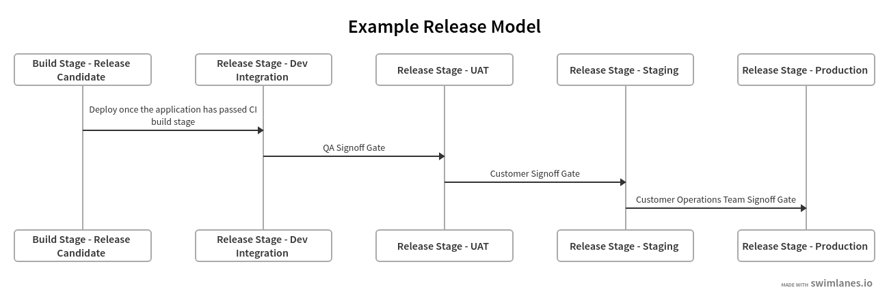
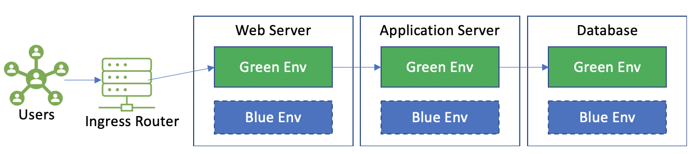
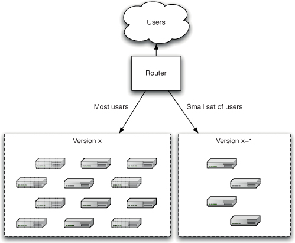

# 持续交付

持续交付背后的灵感，是更频繁地把有价值的软件持续交付给用户与开发者。应用本页列出的原则与实践，可以帮你降低风险、消除手工操作、提升质量与信心。

部署软件涉及以下原则：

1. 为你的应用供给并管理云环境运行时（云资源、基础设施、硬件、服务等）。
2. 在云环境中安装目标应用版本。
3. 配置你的应用，包括所需的数据。

持续交付流水线是你的流程的自动化体现，以一致、可重复的方式把上述原则流线化。

## 目标

* 遵循行业最佳实践，把软件改动交付给客户与开发者。
* 在组装持续交付工作流时，为指导原则与最佳实践建立一致性。

## 通用指导

### 定义发布策略

在项目规划阶段，开发负责人与应用利益相关方之间就发布策略/设计达成共识很重要。这一共识包括应用在其整个 SDLC 中的部署与维护。

#### 发布策略原则

Jez Humble 与 David Farley 的《*Continuous Delivery*》一书记录了制定发布策略时要遵循的关键考量：

* 每个环境的部署负责人，以及发布负责人分别是谁。
* 一套资产与配置管理策略。
* 列清可用于验收、容量、集成与用户验收测试的环境，以及构建在这些环境间流转的过程。
* 描述部署到测试与生产环境要遵循的流程，例如需要开启哪些变更请求、需要授予哪些审批。
* 讨论应用部署时配置与运行时配置的管理方式，以及它与自动化部署过程的关系。
* 描述与任何外部系统的集成。它们作为发布的一部分在哪个阶段、如何被测试？发生问题时技术运维人员如何与服务提供方沟通？
* 一套灾难恢复计划，使应用状态能在灾难后恢复。如果应用失败，重启或重新部署需要哪些步骤就绪。
* 生产环境的规格与容量规划：你的线上应用会产生多少数据？需要多少日志文件或数据库？需要多少带宽和磁盘空间？客户端期望的延迟是多少？
* 首次部署到生产如何进行。
* 修复缺陷与打补丁到生产环境如何处理。
* 生产环境升级如何处理，包括数据迁移。如何在不破坏其状态的前提下对应用做升级。

### 应用发布与环境提升

你的发布体现过程应当取提交阶段创建的2可部署构建产物，并把它部署到所有云环境，从测试环境开始。

测试环境（*通常称为 Integration*）充当门禁：校验你的测试套件对全部发布候选都成功完成。这一校验应当始终从测试环境开始，检视从包含你代码改动的功能/发布分支集成而来的已部署发布。

发布到 *test* 环境的代码改动，通常目标是主分支（做 [trunk](https://devblogs.microsoft.com/devops/release-flow-how-we-do-branching-on-the-vsts-team/#why-trunk-based-development) 时）或发布分支（做 [gitflow](https://www.atlassian.com/git/tutorials/comparing-workflows/gitflow-workflow) 时）。

#### 首次部署

任何应用的首次部署都应当在类生产环境（*UAT*）中向客户展示，以便尽早获取反馈。UAT 环境用于获取产品负责人签字验收，最终把发布提升到生产。

#### 类生产环境的标准

* 运行与生产相同的操作系统。
* 安装与生产相同的软件。
* 规格与配置与生产相同。
* 镜像生产的网络拓扑。
* 发布后执行模拟的类生产负载测试，暴露出任何延迟或吞吐退化。

#### 为你的发布流水线建模

为测试与发布过程建模至关重要，它能在应用工程师与客户利益相关方之间建立共识 —— 尤其是就需预供给多少个云环境对齐预期，以及定义签字门禁的角色与职责。

**发布流水线建模注意事项**

* 描述应用改动在发布到生产之前必须经历的所有阶段。
* 定义所有发布门禁控制。
* 确定客户特有的云 RBAC 组，这些组有权按环境审批发布候选。

#### 发布流水线的阶段

你发布工作流中的各个阶段，最终都是在测试应用的一个版本，校验它能否按你的验收标准发布。发布流水线应当考虑以下条件：

* **发布选择**：执行应用测试的开发者应当能选择要部署到测试环境的发布版本。
* **部署**：把应用的可部署构建产物（*由 CI 阶段创建*）发布到目标云环境。
* **配置**：应用在全部环境中应当被一致地配置。这些配置在部署时应用。应用密钥和证书这类敏感数据应当放在完全托管的 PaaS 密钥库（如 [Key Vault](https://azure.microsoft.com/en-us/services/key-vault/)、[KMS](https://aws.amazon.com/kms/)）中管理。应用使用的任何密钥都应当在应用内部获取。应用密钥不应当在运行时环境中暴露。我们鼓励遵循 12-Factor 原则，尤其是[配置管理](https://12factor.net/config)方面。
* **数据迁移**：预填充运行时环境所需的应用状态和/或数据记录。这可能还包括端到端集成测试套件所需的测试数据。
* **部署冒烟测试**。冒烟测试还应当验证你的应用指向了正确的配置（例如生产环境却指向了 UAT 数据库）。
* 执行任何手动或自动的验收测试场景。
* 批准发布门禁，把应用版本提升到目标云环境。这次提升还应当包含环境的配置状态（例如新的环境设置、功能开关等）。

#### 线上发布预热

发布应当在被视为可上线并接受用户流量之前运行一段时间。这些*预热*活动可能包括应用服务器与数据库预填充任何依赖的缓存，以及建立所有服务连接（例如*连接池分配等*）。

#### 预生产发布

应用发布候选应当部署到与生产相似的 staging 环境，以执行最终的手动/自动测试（*包括容量测试*）。你的生产与 staging/预生产云环境应当在项目开始时就已经建好。

应用预热应当是一个可量化的度量，并在预生产冒烟测试中予以校验。

### 回滚发布

你的发布策略应当考虑部署后发生意外失败时的回滚场景。

回滚发布可能变得很麻烦，尤其是当部署导致数据库记录/对象发生变更时（*无论是否出于本意*）。如果没有需要回退的数据改动，那么你只需为最后一个已知良好的生产版本触发新的发布候选，并沿 CD 流水线提升它即可。

对于涉及数据改动的回滚场景，有多种缓解方案，但它们超出了本指南的范围。其中一些涉及数据库记录版本化、对数据库记录/对象做时间回溯等。在每次发布之前都应该备份所有数据文件和数据库，以便能够恢复。这类场景的缓解策略在我们的项目中会有不同。预期是这个缓解策略应当作为发布策略的一部分被覆盖。

设计发布策略时另一个可以考虑的方法是[部署环（deployment rings）](https://learn.microsoft.com/en-us/azure/devops/migrate/phase-rollout-with-rings?view=azure-devops)。这种方法通过在生产环境中渐进式地部署并验证改动，既简化了回滚场景，又限制了发布对最终用户的影响。

### 零停机发布

热部署的过程是把用户从一个发布切到另一个发布，且不影响用户体验。举例来说，Azure 托管应用服务允许开发者在 staging 部署槽中验证应用改动，然后再与生产槽交换。一旦源槽完全预热，应用服务槽交换也可以完全自动化（并启用[自动交换](https://learn.microsoft.com/en-us/azure/app-service/deploy-staging-slots#configure-auto-swap)）。当技术运维人员把槽恢复到交换前状态时，槽交换也简化了发布回滚。

Kubernetes 原生支持[滚动更新](https://kubernetes.io/docs/tutorials/kubernetes-basics/update/update-intro/)。

### 蓝绿部署

蓝/绿是一种部署技术：通过运行两个完全相同的生产环境实例 —— 称为 *Blue* 和 *Green* —— 来减少停机。

在任一时刻，只有其中一个环境接受线上生产流量。

在上面的例子中，线上生产流量被路由到 Green 环境。应用发布期间，新版本部署到 Blue 环境，这与 Green 环境相互独立。Blue 环境的发布不影响线上流量。你可以把端到端测试套件指向 Blue 环境，作为测试检出点之一。

把用户迁移到新应用版本，只需要修改路由配置，把所有流量指向 Blue 环境。

这种技术简化了回滚场景，因为我们只需把路由切回 Green。

Cosmos 和 Azure SQL 这类数据库提供方原生支持数据复制，有助于实现完全同步的蓝绿数据库环境。

### 金丝雀发布

金丝雀发布让开发团队在向生产部署新功能时能更快获得反馈。这类发布先推广到一部分生产节点（*不向这些节点路由用户*），以收集关于容量测试、功能完整性与影响面的早期洞察。

一旦冒烟测试与容量测试完成，你就可以把一小部分用户路由到承载发布候选的生产节点。

金丝雀发布简化了回滚，因为你可以避免把用户路由到不良的应用版本。

尽量限制生产环境中并行运行的应用版本数量，因为那会让维护与监控控制变得复杂。

### 低代码方案

低代码方案在应用与流程中的参与度越来越高，因此需要多学科的恰当结合来提升它们的开发水平。

这里有一份[低代码方案的持续部署指南](https://github.com/microsoft/code-with-engineering-playbook/blob/main/docs/CI-CD/recipes/cd-on-low-code-solutions.md)。

## 相关资源

* [Continuous Delivery](https://www.continuousdelivery.com/)，Jez Humble、David Farley 著。
* [持续集成 vs 持续交付 vs 持续部署](https://www.atlassian.com/continuous-delivery/principles/continuous-integration-vs-delivery-vs-deployment)
* [部署环](https://learn.microsoft.com/en-us/azure/devops/migrate/phase-rollout-with-rings?view=azure-devops)

### 工具

以下工具可以帮助落实上面列出的一些 CD 最佳实践：

* [Flux](https://fluxcd.io/docs/concepts/) —— 用于 GitOps
* [使用 GitOps 的 CI/CD 工作流](https://learn.microsoft.com/en-us/azure/azure-arc/kubernetes/conceptual-gitops-ci-cd#example-workflow)
* [Tekton](https://github.com/tektoncd) —— 用于 Kubernetes 原生流水线
  * 注意 Jenkins-X 底层使用的就是 Tekton。
* [Argo Workflows](https://github.com/argoproj/argo-workflows)
* [Flagger](https://github.com/fluxcd/flagger) —— 用于强大的 Kubernetes 原生发布，包括蓝绿、金丝雀和 A/B 测试。
* 与 CD 关系不太大，但可以看一下 [jsonnet](https://jsonnet.org/)，一种减少样板代码、提高 yaml/json 清单之间共享度的模板语言。


**非官方社区翻译** —— 本页译自 [microsoft/code-with-engineering-playbook](https://github.com/microsoft/code-with-engineering-playbook) 的 `docs/CI-CD/continuous-delivery.md`，原文档以 [CC BY 4.0](https://creativecommons.org/licenses/by/4.0/) 许可发布。本翻译不是 Microsoft 官方版本，且可能包含改动。

