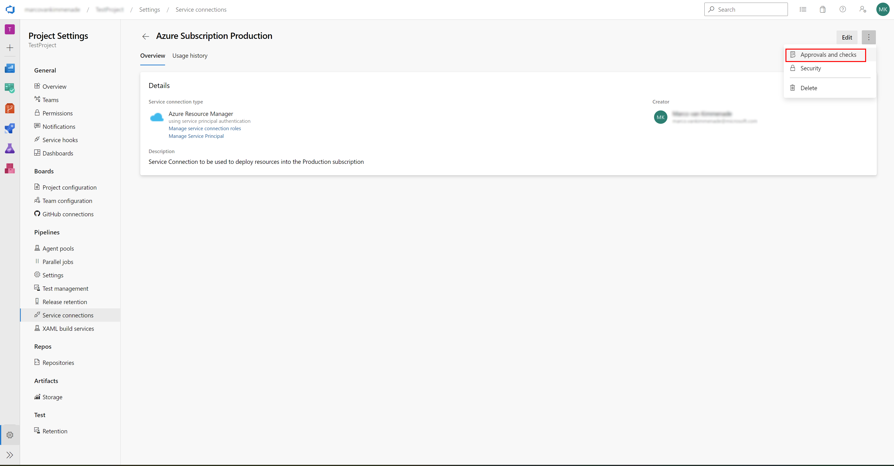
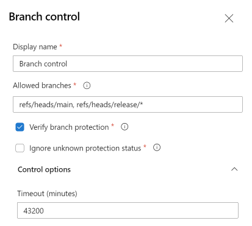

# Azure DevOps 服务连接安全

服务连接（Service Connection）在 Azure DevOps 流水线中用于连接外部服务，例如 Azure、GitHub、Docker、Kubernetes 以及许多其他服务。服务连接可用于向这些外部服务认证，并调用多种类型的命令，例如在 Azure 中创建和更新资源、把容器镜像上传到 Docker、或把应用部署到 Kubernetes。

为了能够调用这些命令，服务连接需要拥有相应的权限。对大多数类型的服务连接而言，权限可以限定到一部分资源上，以限制它们能访问的范围。为了改進最小权限原则，为 Dev/Test/QA/Prod 等不同环境分别建立服务连接是很常见的做法。

## 服务连接安全加固

可以通过几种方法来加固服务连接。

* 可以配置[用户权限](https://learn.microsoft.com/en-us/azure/devops/pipelines/library/service-endpoints#user-permissions)，确保只有正确的用户能创建、查看、使用和管理该服务连接。
* 可以配置[流水线级权限](https://learn.microsoft.com/en-us/azure/devops/pipelines/library/service-endpoints#pipeline-permissions)，确保只有经过批准的 YAML 流水线能使用该服务连接。
* 可以配置[项目权限](https://learn.microsoft.com/en-us/azure/devops/pipelines/library/service-endpoints#project-permissions---cross-project-sharing-of-service-connections)，确保只有特定的 Azure DevOps 项目能使用该服务连接。

用了以上方法之后，被保护的是**谁**能使用服务连接。 然而，仍然*没有被保护*的是：能用服务连接**做什么**。

由于服务连接在外部服务中拥有全部必需权限，因此加固服务连接、使其不会被意外或恶意使用就至关重要。 一个例子是：某条 Azure DevOps 流水线使用指向某个 Azure 资源组（或整个订阅）的服务连接去列出所有资源，然后把它们删除。如果没有恰当的安全措施，完全可能在没有做任何校验或评审的情况下执行这条流水线。

```yaml
pool:
  vmImage: ubuntu-latest

steps:
- task: AzureCLI@2
  inputs:
    azureSubscription: 'Production Service Connection'
    scriptType: 'pscore'
    scriptLocation: 'inlineScript'
    inlineScript: |
      $resources = az resource list
      foreach ($resource in $resources) {
        az resource delete --ids $resource.id
      }
```

## 流水线安全的陷阱

YAML 流水线可以在不需要拉取请求的情况下被触发，这引入了安全风险。

良好的做法是：用[拉取请求](https://github.com/microsoft/code-with-engineering-playbook/blob/main/docs/code-reviews/pull-requests.md)和代码评审来确保正在部署的代码被第二个人评审过，并可能被自动检查漏洞和其他安全问题。 然而，YAML 流水线可以不需要拉取请求和代码评审就执行。这让（恶意的）用户能够利用服务连接做出本应需要评审者才能做的改动。

流水线*何时*被触发，是在 YAML 流水线自身中指定的，因此流水线可以被配置为在临时分支有改动时执行。在这个临时分支中，对流水线自身所做的任何改动都会在未经评审的情况下被执行。

如果给定的流水线已被授予使用某个特定服务连接的[流水线级权限](https://learn.microsoft.com/en-us/azure/devops/pipelines/library/service-endpoints#pipeline-permissions)，那么就可以用该服务连接执行任何命令，而无人评审该命令。 由于服务连接在外部服务中可能拥有很多权限，未经评审地执行任何流水线都可能带来严重后果。

## 服务连接检查

为了防止服务连接被意外误用，可以配置若干检查。这些检查配置在服务连接本身上，因此只能由该服务连接的所有者或管理员配置。某条 YAML 流水线的使用者无法修改这些检查，因为检查并不定义在 YAML 文件里。 配置可在服务连接的 Approvals and Checks（审批与检查）菜单中完成。



### 分支控制

通过在服务连接上配置分支控制（Branch Control），你可以控制该服务连接只能在流水线从特定分支运行时被使用。

把分支控制配置为只允许主分支（可能再加上发布分支），你就能确保只有在流水线的改动已合入主分支之后，该 YAML 流水线才能使用该服务连接 —— 也就意味着它已经通过了任何拉取请求检查和代码评审。 作为额外检查，分支控制还能验证允许的分支上是否真的配置了分支保护（例如必需的拉取请求和代码评审）。

有了分支控制，再配合分支保护，就不再可能在没有多人评审命令的情况下对服务连接执行任何命令。因此，意外或恶意地滥用服务连接所拥有的权限也就不再可能。

> **注意：** 当“允许的分支”设置为通配符时，任何人都可以创建一个匹配该通配符的分支并使用该服务连接。可以用 [git 权限](https://learn.microsoft.com/en-us/azure/devops/repos/git/require-branch-folders#enforce-permissions)配置为只有管理员才能创建某些分支，例如发布分支。




**非官方社区翻译** —— 本页译自 [microsoft/code-with-engineering-playbook](https://github.com/microsoft/code-with-engineering-playbook) 的 `docs/CI-CD/dev-sec-ops/azure-devops-service-connection-security.md`，原文档以 [CC BY 4.0](https://creativecommons.org/licenses/by/4.0/) 许可发布。本翻译不是 Microsoft 官方版本，且可能包含改动。

