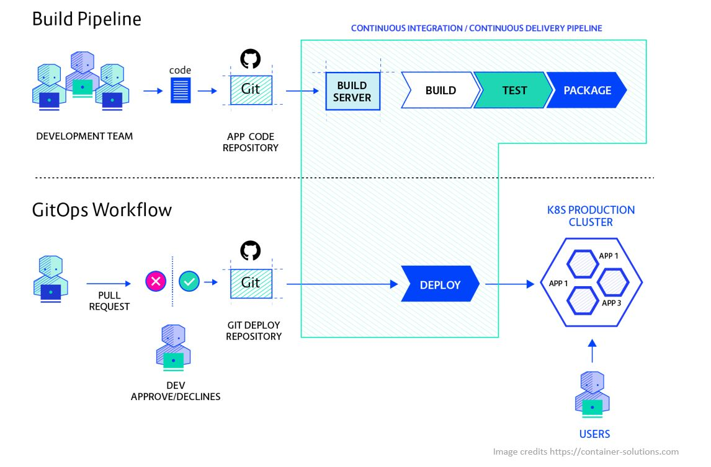

# 用 GitOps 部署

## 什么是 GitOps？

“GitOps 是一种运维架，它把应用开发中使用的 DevOps 最佳实践 —— 如版本控制、协作、合规和 CI/CD —— 应用到基础设施自动化上。”见 [GitLab：什么是 GitOps？](https://about.gitlab.com/topics/gitops/)。

## 为什么要用 GitOps？

GitOps 通过把 git 仓库置于中心，让部署更快，同时借由 git 提交提供清晰的审计跟踪，且不需要直接访问环境。更多见[为什么要用 GitOps？](https://www.gitops.tech/#why-should-i-use-gitops)

下图对比了传统 CI/CD 与 GitOps 工作流： 

## GitOps 工具

由 [CNCF](https://landscape.cncf.io/card-mode?category=continuous-integration-delivery) 社区支持的、面向 Kubernetes 的一些流行 GitOps 架：

* [Flux V2](https://fluxcd.io/docs/get-started/)
* [Argo CD](https://argo-cd.readthedocs.io/en/stable/)
* [Rancher Fleet](https://fleet.rancher.io/)

## 用 GitOps 部署

在 Azure Kubernetes Service（AKS）托管集群或启用了 Azure Arc 的 Kubernetes 连接集群中，可以以集群扩展的形式启用基于 Flux v2 的 GitOps。安装 microsoft.flux 集群扩展后，你可以创建一个或多个 fluxConfigurations 资源，把 Git 仓库源同步到集群，并把集群调谐到期望状态。使用 GitOps，你可以把 Git 仓库作为集群配置与应用部署的唯一事实来源。

* [教程：在启用了 Azure Arc 的 Kubernetes 集群上用 GitOps 部署配置](https://learn.microsoft.com/en-us/azure/azure-arc/kubernetes/tutorial-use-gitops-connected-cluster)
* [教程：用 GitOps 实现 CI/CD](https://learn.microsoft.com/en-us/azure/azure-arc/kubernetes/tutorial-gitops-flux2-ci-cd)
* [使用 Flux v2 的多集群多租户环境](https://github.com/microsoft/multicluster-gitops)


**非官方社区翻译** —— 本页译自 [microsoft/code-with-engineering-playbook](https://github.com/microsoft/code-with-engineering-playbook) 的 `docs/CI-CD/gitops/deploying-with-gitops.md`，原文档以 [CC BY 4.0](https://creativecommons.org/licenses/by/4.0/) 许可发布。本翻译不是 Microsoft 官方版本，且可能包含改动。

