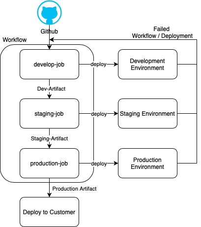
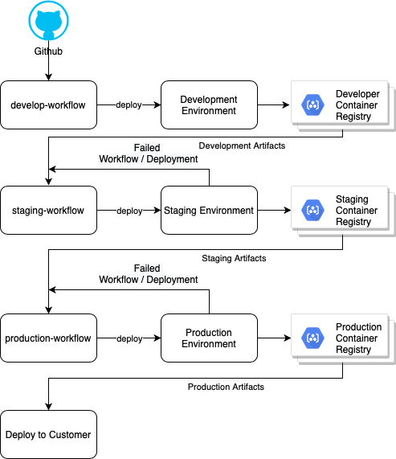

# GitHub Workflows

工作流（workflow）是一个可配置的自动化过程，由一个或多个作业组成，其中每个作业都可以是 GitHub 中的一个 action。目前在 GitHub 中定义工作流支持 YAML 文件格式。

关于 GitHub Actions 与 GitHub Workflows 的更多信息，见下面[相关资源](#相关资源)一节中的链接。

## 每个环境一个工作流

通用做法是只有一条流水线：代码在其中被构建、测试和部署，然后产物被提升到下一个环境，最终部署到生产。

在 GitHub 中有多种方式可以实现环境配置。一种方式是用一个工作流服务多个环境；但随着向工作流中添加更多过程和作业，复杂度会上升 —— 不过这并不意味着小型流水线不能这么做。单工作流的好处是，当产物从一个环境流到另一个环境时，部署环境之间的状态与环境取值可以很方便地传递。

绕开单一工作流复杂度的一种方式，是为不同环境建立各自独立的工作流，确保只有已创建并验证通过的产物才被提升到下一个环境，同时让工作流足够小、便于排查其中出现的任何问题。在这种情况下，状态与环境取值需要从一个部署环境传到另一个。多个工作流也有助于让各环境的部署保持独立，从而减少部署耗时、更早发现问题而不是到流程后期才发现。此外，由于各环境相互独立，某个环境部署失败不会阻塞其他环境的部署。这种方式的一个代价是：每个环境各有一套工作流，随着工作流复杂度随时间上升，维护成本也会增加。

## 相关资源

* [GitHub Actions](https://docs.github.com/en/actions)
* [GitHub Workflows](https://docs.github.com/en/actions/reference/workflow-syntax-for-github-actions)


**非官方社区翻译** —— 本页译自 [microsoft/code-with-engineering-playbook](https://github.com/microsoft/code-with-engineering-playbook) 的 `docs/CI-CD/gitops/github-workflows.md`，原文档以 [CC BY 4.0](https://creativecommons.org/licenses/by/4.0/) 许可发布。本翻译不是 Microsoft 官方版本，且可能包含改动。

