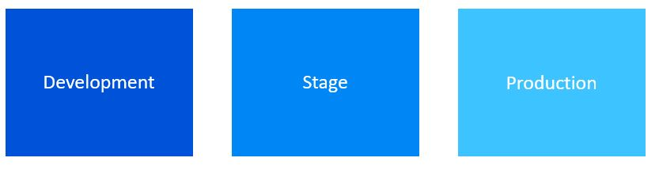

# 低代码方案的持续交付

低代码与无代码平台已在各类业务解决方案中占据一席之地，涉及流程自动化、AI 模型、机器人、业务应用与商业智能。这些平台所能支撑的场景在不断演进，也为许多生产型角色腾出了位置。正因如此，把更专业的工具引入它们的开发才变得必要 —— 例如受控、自动化的交付。

对于 Power Platform 系列产品，引入 CI/CD 过程看似会让面向[公民开发者](https://www.gartner.com/en/information-technology/glossary/citizen-developer)的解决方案变复杂；但实际上更重要的，是让开发过程更具扩展性、能更快地处理新功能和缺陷修复。

## Power Platform 解决方案中的环境

环境是 Power Platform 解决方案存在的空间。它们存储、管理并共享与解决方案相关的一切，例如数据、应用、聊天机器人、流程和模型。它们也充当容器，把可能具有不同角色、安全要求或只是面向不同受众的应用隔离开。它们可以用来建立解决方案开发过程的不同阶段；在 CI/CD 过程中使用环境的预期模型如以下图示。

### 环境注意事项

环境一旦创建，其资源只能被同一租户内的用户访问 —— 而租户事实上就是一个 Azure Active Directory 租户。当你在某个环境中创建应用时，该应用只能与同样部署在该环境中的数据源交互，这包括连接、流程和 Dataverse 数据库。在处理 CD 过程时，这是一个重要的考量。

## 部署策略

在已经创建了三个环境来代表部署阶段之后，现在的目标是把从一个环境到另一个环境的部署自动化。每个环境都需要创建自己的解决方案：业务逻辑和数据。

### 第 1 步

开发团队将在 **Dev** 环境中工作。根据团队情况，这些环境可以一个团队共用一个，也可以每位开发者一个。

改动完成后，第一步是把解决方案打包并导出到版本控制中。

### 第 2 步

第二步是关于解决方案的：你需要有一个**托管（managed）解决方案**才能部署到 **Stage** 或 **Production** 等其他环境，所以这时你应该使用一个 JIT 环境，在其中导入你的非托管解决方案，再导出为托管解决方案。这些解决方案文件不会被检入版本控制，而是作为构建产物存放在流水线中，使其可在发布流水线中被部署。这就是第二个环境的用途。这第二个环境负责接收来自产物的输出托管解决方案。

### 第 3 步

第三步也是最后一步，将把解决方案导入生产环境，这意味着这一阶段会取上一步的产物并将其导出。在这个环境中工作时，你还可以对产品做版本管理，以便更好地追溯产品。

## 工具

完成这一过程最常用的工具是：

* [Power Platform Build Tools](https://marketplace.visualstudio.com/items?itemName=microsoft-IsvExpTools.PowerPlatform-BuildTools)
* 还有一个非图形化工具可用于完成这套 CD 过程：[Power CLI](https://aka.ms/PowerAppsCLI)。

## 相关资源

[使用 Microsoft Power Platform 做应用生命周期管理](https://learn.microsoft.com/en-us/power-platform/alm/)


**非官方社区翻译** —— 本页译自 [microsoft/code-with-engineering-playbook](https://github.com/microsoft/code-with-engineering-playbook) 的 `docs/CI-CD/recipes/cd-on-low-code-solutions.md`，原文档以 [CC BY 4.0](https://creativecommons.org/licenses/by/4.0/) 许可发布。本翻译不是 Microsoft 官方版本，且可能包含改动。

