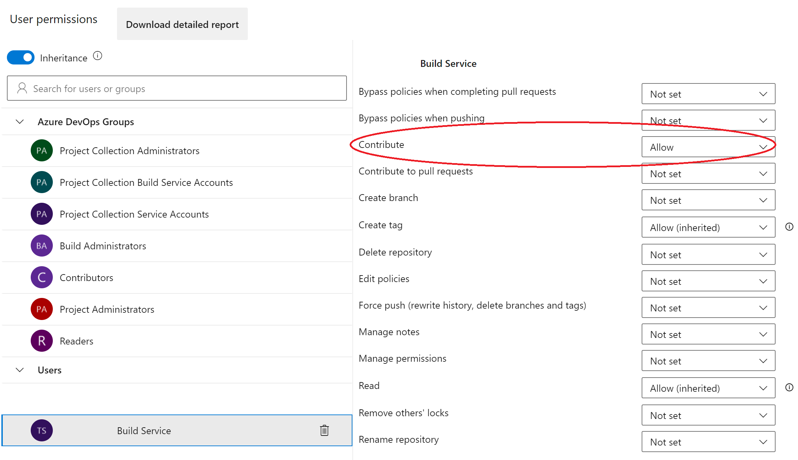

# 用 Jupyter Notebook 做 CI

由于 Azure DevOps 不允许代码评审者直接在 Jupyter Notebook 中评论，数据科学家（DS）必须先把手写的 notebook 转成脚本，再提交并推送这些文件到仓库。

本文旨在把这一过程在 Azure DevOps 中自动化，让 DS 不必在本地执行任何操作。

## 问题描述

一个数据科学仓库有这样的目录结构：

```bash
    .
    ├── notebooks
    │   ├── Machine Learning Experiments - 00.ipynb
    │   ├── Machine Learning Experiments - 01.ipynb
    │   ├── Machine Learning Experiments - 02.ipynb
    │   ├── Machine Learning Experiments - 03.ipynb
    └── scripts
        ├── Machine Learning Experiments - 00.py
        ├── Machine Learning Experiments - 01.py
        ├── Machine Learning Experiments - 02.py
        └── Machine Learning Experiments - 03.py
```

这些 Python 文件是必需的，以便拉取请求评审者能对 notebook 加评论 —— 他们可以对 Python 脚本加评论，我们再把这些评论应用到 notebook 上。

由于我们必须在把文件加入提交之前手动运行这个过程，手动很容易出错，例如：我们创建了一个 notebook、从它生成了脚本，但之后又做了修改、却忘了为这些修改生成新脚本。

## 解决方案

避免这个问题的一种方式，是在仓库中从提交创建脚本。本文将描述这个过程。

我们可以向仓库添加一条包含以下步骤的流水线，对 `ipynb` 文件运行：

1. 进入 *Project Settings* -> *Repositories* -> *Security* -> *User Permissions*
2. 在 *Users* 中为 *Build Service* 添加 *Contribute* 权限

   
3. 创建一条新流水线。

在新建的流水线中，我们加入：

1. 针对 ipynb 文件的触发：

   ```yml
   trigger:
     paths:
     include:
       - '*.ipynb'
       - '**/*.ipynb'
   ```
2. 选择 Linux 池：

   ```yml
   pool:
     vmImage: ubuntu-latest
   ```
3. 设置我们希望存放脚本的目录：

   ```yml
   variables:
     REPO_URL: # Azure DevOps URL in the format: dev.azure.com/<Organization>/<Project>/_git/<RepoName>
   ```
4. 接下来是流水线的核心：

   1. 升级 pip

   ```yml
   - script: |
       python -m pip install --upgrade pip
     displayName: 'Upgrade pip'

   ```

   2. 安装 `nbconvert` 与 `ipython`：

   ```yml
   - script: |
       pip install nbconvert ipython
     displayName: 'install nbconvert & ipython'
   ```

   3. 安装 `pandoc`：

   ```yml
   - script: |
       sudo apt install -y pandoc
     displayName: "Install pandoc"
   ```

   4. 找出仓库最后一次提交中的 notebook 文件（`ipynb`）并转为脚本（`py`）：

   ```yml
   - task: Bash@3
       inputs:
         targetType: 'inline'
         script: |
           IPYNB_PATH=($(git diff-tree --no-commit-id --name-only -r $(Build.SourceVersion) | grep '[.]ipynb$'))
           echo $IPYNB_PATH
           [ -z "$IPYNB_PATH" ] && echo "Nothing to convert" || jupyter nbconvert --to script $IPYNB_PATH
       displayName: "Convert Notebook to script"
   ```

   5. 把这些改动提交到仓库：

   ```yml
   - bash: |
       git config --global user.email "build@dev.azure.com"
       git config --global user.name "build"
       git add .
       git commit -m 'Convert Jupyter notebooks' || echo "No changes to commit" && NO_CHANGES=1
       [ -z "$NO_CHANGES" ] || git push https://$(System.AccessToken)@$(REPO_URL) HEAD:$(Build.SourceBranchName)
     displayName: "Commit notebook to repository"
   ```

现在我们就有了一条在提交 notebook 时自动生成脚本的流水线。


**非官方社区翻译** —— 本页译自 [microsoft/code-with-engineering-playbook](https://github.com/microsoft/code-with-engineering-playbook) 的 `docs/CI-CD/recipes/ci-with-jupyter-notebooks.md`，原文档以 [CC BY 4.0](https://creativecommons.org/licenses/by/4.0/) 许可发布。本翻译不是 Microsoft 官方版本，且可能包含改动。

