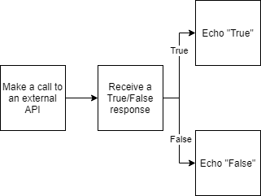
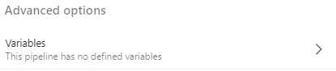
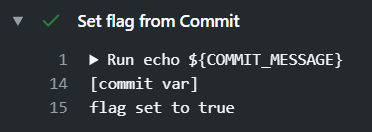
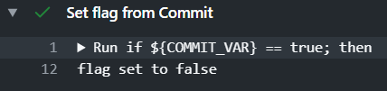
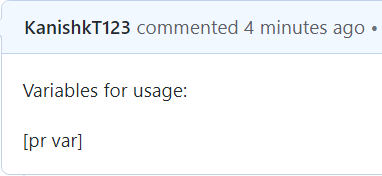
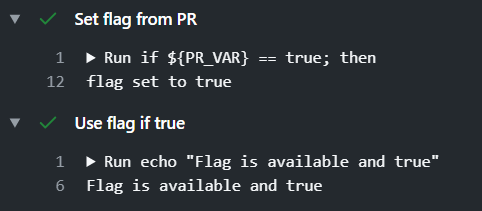
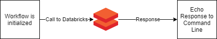
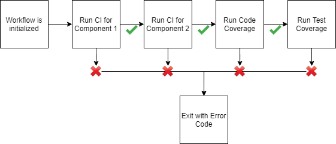

# GitHub Actions 中的运行时变量

## 目标

GitHub Actions 是编写和运行 CI/CD 流水线的热门选择，尤其是对托管在 GitHub 上的开源项目；但它缺少其他 CI/CD 环境中已有的一些便利特性。GitHub Actions 尚未实现的一个关键特性，是能够把**运行时变量模拟并注入**工作流，从而测试流水线本身。

本文在 Azure DevOps 已有的这项特性与 GitHub Actions 尚未发布的对应能力之间搭一座桥。

## 目标读者

本指南假定你熟悉 CI/CD，并理解 CI/CD 流水线的安全含义。我们也假定你具备 GitHub Actions 的基础知识，包括如何编写和运行一条基础 CI/CD 流水线、在 action 内检出仓库、使用带版本控制的 Marketplace Actions 等。

我们假定作为 CI/CD 工程师，你希望能把环境变量或环境标志注入流水线与工作流以测试它们，并使用 GitHub Actions 来完成这件事。

## 使用场景

许多集成或端到端工作流需要特定的环境变量，而这些变量只在运行时才可得。例如，一个工作流可能在做以下事情：



在这种情况下，如果不对外部资源发起调用，测试流水线会极为困难。而很多情况下，对外部资源发起调用可能很贵或很耗时，会显著拖慢内循环开发。

以 Azure DevOps 为例，它提供了在手动触发时定义流水线变量的方式：



GitHub Actions 目前还没有这个能力。

## 解决方案

绕开这个问题最简单的做法，是把运行时变量加到提交信息或 PR 描述里，再用 `grep` 找出该变量。GitHub Actions 通过 `contains` 函数原生提供了类似 `grep` 的能力，我们正是要用它。

范围内：

* 我们将其限定为：向流水线注入一个环境变量，且键与值是事先已知的。

范围外：

* 虽然这个方案显然可以用 shell 脚本或任何其他创建变量的方式扩展，但本方案主要用于验证基本概念。本指南不提供这类脚本。
* 此外，团队可能希望用一个额外的 PR 模板把它们提供的变量规范化。本指南不包含这部分。

> 安全警告： **这不能用于注入密钥** —— 因为提交信息和 PR 描述可以被第三方获取、会存在 `git log` 中，也可能被恶意人员用各种工具读取。它适用于测试需要注入简单变量的工作流，如上所述。 **如果你需要获取密钥或敏感信息**，请使用 [Azure Key Vault 的 GitHub Action](https://github.com/marketplace/actions/get-secrets-from-azure-key-vault) 或其他类似的密钥存储与获取服务。

## 提交信息变量

如何用**指定的键和值**向环境注入一个变量供使用。在本例中，键是 `COMMIT_VAR`，值是 `[commit var]`。

前置条件：

* 流水线触发器已正确配置为在推送提交时触发（这里我们使用 `actions-test-branch` 作为分支）

代码片段：

```yaml
on:
  push:
    branches:
      - actions-test-branch

jobs:
  Echo-On-Commit:
    runs-on: ubuntu-latest
    steps:
      - name: "Checkout Repository"
        uses: actions/checkout@v2

      - name: "Set flag from Commit"
        env:
          COMMIT_VAR: ${{ contains(github.event.head_commit.message, '[commit var]') }}
        run: |
          if ${COMMIT_VAR} == true; then
            echo "flag=true" >> $GITHUB_ENV
            echo "flag set to true"
          else
            echo "flag=false" >> $GITHUB_ENV
            echo "flag set to false"
          fi

      - name: "Use flag if true"
        if: env.flag
        run: echo "Flag is available and true"
```

代码说明：

代码第一部分是在工作分支上配置 Push 触发器并检出仓库，我们不展开细讲。

```yaml
- name: "Set flag from Commit"
  env:
    COMMIT_VAR: ${{ contains(github.event.head_commit.message, '[commit var]') }}
```

这是我们 GitHub Actions 流水线中唯一 Job 里的一个命名步骤。这里我们为该步骤设置了一个环境变量：该步骤调用的任何代码或 action 都能使用这个环境变量。

`contains` 是 GitHub Actions 默认在所有工作流中可用的函数，返回布尔值 `true` 或 `false`。在这里，它检查最后一次推送的提交信息中（通过 `github.event.head_commit.message` 访问）是否包含该字符串。`${{...}}` 是必需的，用于使用 GitHub Context，使函数和 `github.event` 变量对该命令可用。

```yaml
run: |
  if ${COMMIT_VAR} == true; then
    echo "flag=true" >> $GITHUB_ENV
    echo "flag set to true"
  else
    echo "flag=false" >> $GITHUB_ENV
    echo "flag set to false"
  fi
```

这里的 `run` 命令检查 `COMMIT_VAR` 变量是否被设为 `true`；如果是，就把一个次级标志设为 true 并回显这一行为。变量为 `false` 时也同样处理。

这做的具体原因是，让 `flag` 变量能在后续步骤中使用，而不必在每个步骤里重复使用 `COMMIT_VAR`。此外，它还让这个标志能用在 action 的 `if` 步骤中，如下一段片段所示。

```yaml
- name: "Use flag if true"
  if: env.flag
  run: echo "Flag is available and true"
```

在这部分片段中，同一 Job 的下一个步骤使用了上一步骤设置的 `flag`。这使用户可以：

1. 复用该标志，而不必反复访问 GitHub Context
2. 用多个条件设置该标志，而不只是一个。例如，另一个步骤也可能因不同原因把该标志设为 `true` 或 `false`。
3. 只在一个地方修改变量，而不必在多处修改

更短的写法：

“Set flag from commit” 这一步可以简化为下面这样，使代码短得多（虽然不一定更可读）：

```yaml
- name: "Set flag from Commit"
  env:
    COMMIT_VAR: ${{ contains(github.event.head_commit.message, '[commit var]') }}
  run: |
    echo "flag=${COMMIT_VAR}" >> $GITHUB_ENV
    echo "set flag to ${COMMIT_VAR}"
```

使用方式：

包含变量时：

1. 推送到 `master` 分支：

   ```cmd
   > git add.
   > git commit -m "Running GitHub Actions Test [commit var]"
   > git push
   ```
2. 这会触发工作流（任何推送都会）。由于提交信息中包含 `[commit var]`，工作流中的 `${COMMIT_VAR}` 变量会被设为 `true`，结果如下：



不包含变量时：

1. 推送到 `master` 分支：

   ```cmd
   > git add.
   > git commit -m "Running GitHub Actions Test"
   > git push
   ```
2. 这会触发工作流。由于提交信息中**不**包含 `[commit var]`，工作流中的 `${COMMIT_VAR}` 变量会被设为 `false`，结果如下：



## PR 描述变量

创建 PR 时，PR 描述也可以用来设置变量。这些变量可以对该 PR 派生出的所有工作流运行可用，这有助于让提交信息更信息丰富、更不拥挤，也减轻了开发者的工作。

同样，这里针对的是事先已知的键和值。本例中键是 `PR_VAR`，值是 `[pr var]`。

前置条件：

* 流水线触发器已正确配置为在向特定分支发起拉取请求时触发（这里我们用 master 作为目标分支。）

代码片段：

```yaml
on:
  pull_request:
    branches:
      - master

jobs:
  Echo-On-PR:
    runs-on: ubuntu-latest
    steps:
      - name: "Checkout Repository"
        uses: actions/checkout@v2

      - name: "Set flag from PR"
        env:
          PR_VAR: ${{ contains(github.event.pull_request.body, '[pr var]') }}
        run: |
          if ${PR_VAR} == true; then
            echo "flag=true" >> $GITHUB_ENV
            echo "flag set to true"
          else
            echo "flag=false" >> $GITHUB_ENV
            echo "flag set to false"
          fi

      - name: "Use flag if true"
        if: env.flag
        run: echo "Flag is available and true"
```

代码说明：

YAML 文件的第一部分只是配置拉取请求触发器。后续代码大部分相同，因此我们只解释不同之处。

```yaml
- name: "Set flag from PR"
  env:
    PR_VAR: ${{ contains(github.event.pull_request.body, '[pr var]') }}
```

在这一节，`PR_VAR` 环境变量根据 PR 描述中是否存在 `[pr var]` 字符串，被设为 `true` 或 `false`。

更短的写法：

与上面类似，该 YAML 步骤可以简化如下，使代码短得多（虽然不一定更可读）：

```yaml
- name: "Set flag from PR"
  env:
    PR_VAR: ${{ contains(github.event.pull_request.body, '[pr var]') }}
  run: |
  echo "flag=${PR_VAR}" >> $GITHUB_ENV
  echo "set flag to ${PR_VAR}"
```

使用方式：

1. 向 `master` 创建一个拉取请求，并在描述中某处包含预期变量：

   
2. GitHub Action 会自动触发；由于 PR 描述中存在 `[pr var]`，它会把 `flag` 设为 true，如下所示：

   

## 真实场景

在很多真实场景中，控制环境变量会极有用处。下面列出一些：

### 避免昂贵的外部调用

开发者 A 正在编写和测试一条集成流水线。该集成流水线需要调用外部服务（例如 Azure Data Factory 或 Databricks），等待结果，然后回显结果。工作流可能长这样：



这个工作流天然耗时且运行成本高，因为它涉及维护一个 Databricks 集群并等待响应。可以在编写和测试工作流其他部分的期间，通过模拟响应来去除这个外部依赖；在真实响应无关紧要或并未被直接测试的情况下，也可以模拟响应。

### 跳过耗时的 CI 过程

开发者 B 正在编写和测试一条 CI/CD 流水线。该流水线有多个 CI 阶段，每个阶段顺序执行。工作流可能长这样：



在这种情况下，每个 CI 阶段都需要在前一个开始之前完成，而过程中间出错会导致整条流水线失败。在某些情况下这可能是流水线期望的行为（也许 CI 过程失败时你就不想跑更繁重、更长的构建，或跑耗时的测试覆盖率套件），但它意味着在测试流水线本身时，需要把步骤注释掉或删掉。

另一种做法是：增加一个步骤，检查提交信息或 PR 描述中是否有 `[skip ci $N]` 标记，从而跳过 CI 构建的特定阶段。这能确保最终流水线不会因误改而破损（注释掉/删掉步骤时常会发生这种情况）。它同时提供了一种机制，可以通过跳过其他步骤来反复测试单个步骤，让流水线开发变得容易得多。


**非官方社区翻译** —— 本页译自 [microsoft/code-with-engineering-playbook](https://github.com/microsoft/code-with-engineering-playbook) 的 `docs/CI-CD/recipes/github-actions/runtime-variables/README.md`，原文档以 [CC BY 4.0](https://creativecommons.org/licenses/by/4.0/) 许可发布。本翻译不是 Microsoft 官方版本，且可能包含改动。

