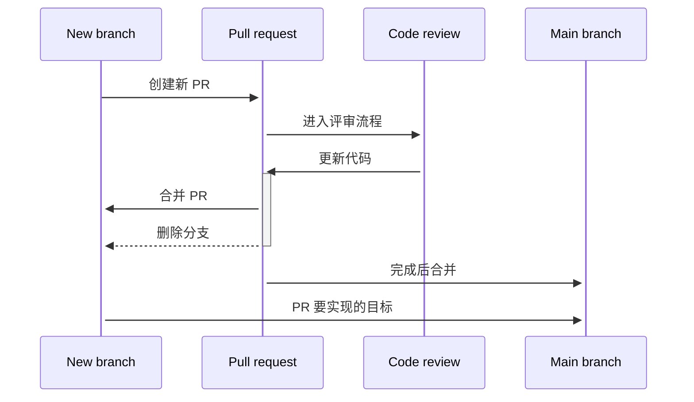

# 拉取请求

对任何主代码库（例如 Git 仓库的 main 分支）的改动，都必须通过拉取请求（pull request，PR）来完成。

拉取请求可以带来：

* 代码检查 —— 见[代码评审](../code-reviews/README.md)
* 对代码运行自动化质量验证
  * Linter
  * 编译
  * 单元测试
  * 集成测试等

对拉取请求的要求可以（也应当）通过策略来强制执行，主流的版本控制与工作项跟踪系统都支持配置这类策略。更多信息见[证据与度量](../code-reviews/evidence-and-measures/README.md)。

## 通用流程

1. 根据当前任务明确的描述与验收标准来实现改动。
2. 然后，在创建新的拉取请求之前：
   * 确认代码符合约定的编码规范
     * 这部分可以用 linter 部分自动化
   * 确保代码能够编译、运行，且没有错误或警告
   * 编写和/或更新测试以覆盖改动，并确保所有新旧测试都通过
   * 编写和/或更新文档，使其与改动保持一致
3. 确认上述标准都满足后，按照[拉取请求模板](../code-reviews/pull-request-template.md)创建并提交新的拉取请求。
4. 走[代码评审流程](../code-reviews/process-guidance/README.md)，把改动合入主代码库。

下图说明了这一过程。



## 规模建议

我们应当始终力求让拉取请求保持小规模。小 PR 有诸多好处：

* 更容易评审；对评审者而言是明确的收益。
* 更容易部署；这与“快速发布、频繁发布”的策略一致。
* 减少可能的冲突和陈旧 PR。

不过我们也要让 PR 保持聚焦 —— 例如围绕一项功能特性、一次优化或代码可读性，避免让 PR 里包含缺乏上下文或耦合松散的代码。PR 没有“正确的大小”，但要记住代码评审是协作过程，过大的 PR 会难以评审、因而评审速度更慢。我们应当始终力求在**仍然产生价值**的前提下把 PR 做到尽可能小。

## 最佳实践

除了规模之外，记住每个 PR 都应当：

* 保持一致，
* 不破坏构建，
* 把相关测试作为 PR 的一部分一并提交。

“保持一致”意味着 PR 中的所有改动都应当服务于同一个目标（例如同一个用户故事），并且彼此内在相关。可以把它理解为针对整个项目的单一职责原则：这个 PR 对项目应当只有**一个变更理由**。

从小处开始 —— 一开始就做出一个小 PR，比事后拆分一个大 PR 容易得多。

根据“不可避免”的成因不同，这里有一些保持 PR 小规模的策略：把 PR 拆成仍然能产生价值的自包含改动；把功能藏在开关后面再发布（见 feature flag、功能开关或金丝雀发布）；或者按层次拆分 PR（例如使用 MVC、观察者/主题这类设计模式）。无论采用哪种策略。

## 拉取请求描述

写得好的 PR 描述有助于维护清晰、结构良好的变更历史。虽然并非每个团队都要遵循同一套规范，但重要的是在项目开始时就把约定敲定下来。

对于开源项目和其他项目来说，一个流行的规范是 [Conventional Commits 规范](https://www.conventionalcommits.org/en/v1.0.0-beta.2/)，其结构为：

```txt
<type>[optional scope]: <description>

[optional body]

[optional footer]
```

其中的 `<type>` 可以从团队定义的类型列表中选择，不过很多项目采用 [Angular 开源项目的提交类型列表](https://github.com/angular/angular/blob/22b96b9/CONTRIBUTING.md#type)。需要明确的是，`scope`、`body` 和 `footer` 都是**可选的**，但只要有了必填的 `type` 和简短描述，就能实现上面提到的那些好处。

另见[拉取请求模板](../code-reviews/pull-request-template.md)。

## 相关资源

* [如何写出优秀的拉取请求描述](https://www.pullrequest.com/blog/writing-a-great-pull-request-description/)
* [用拉取请求做代码评审（Azure DevOps）](https://learn.microsoft.com/azure/devops/repos/git/pull-requests)
* [与 issue 和拉取请求协作（GitHub）](https://help.github.com/en/github/collaborating-with-issues-and-pull-requests)
* [Google 关于 PR 规模的建议](https://google.github.io/eng-practices/review/developer/small-cls.html)
* [Feature Flags](https://www.martinfowler.com/articles/feature-toggles.html)
* [Facebook 隐藏功能的做法](https://launchdarkly.com/blog/secret-to-facebooks-hacker-engineering-culture/)
* [Conventional Commits 规范](https://www.conventionalcommits.org/en/v1.0.0-beta.2/)
* [Angular 提交类型](https://github.com/angular/angular/blob/22b96b9/CONTRIBUTING.md#type)


**非官方社区翻译** —— 本页译自 [microsoft/code-with-engineering-playbook](https://github.com/microsoft/code-with-engineering-playbook) 的 `docs/code-reviews/pull-requests.md`，原文档以 [CC BY 4.0](https://creativecommons.org/licenses/by/4.0/) 许可发布。本翻译不是 Microsoft 官方版本，且可能包含改动。

